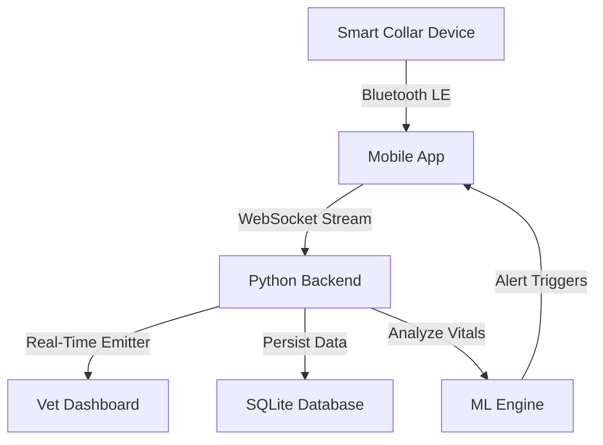

# 🐾 Titan Pet Health Ecosystem
> **Next-Gen Biometric Monitoring & Veterinary Surveillance System**

The **Titan Pet Health Ecosystem** is a state-of-the-art platform designed to bridge the gap between pet owners and veterinary professionals. It uses advanced military-grade UI aesthetics ("Titan Tactical Theme"), real-time biometric telemetry, and machine learning to predict health anomalies before they become critical.

---

## 🏗️ System Architecture

The ecosystem consists of three interconnected pillars:

1.  **Mobile Command Unit (React Native App)**: The interface for pet owners to track live vitals, location, and manage pet profiles.
2.  **Vet Command Center (React/Vite Dashboard)**: A professional dashboard for veterinarians to monitor admitted patients, analyze trends, and manage clinic operations.
3.  **Core Neural Link (Flask Backend)**: The central brain handling real-time WebSocket streams, database persistence, and ML inference.

### High-Level Data Flow


---

## 🛠️ Technology Stack

### 📱 Mobile App (The "Field Unit")
*   **Framework**: React Native (Expo SDK 52)
*   **UI/UX**: Custom "Titan Glass" Design System
    *   `Expo BlurView` for glassmorphism
    *   `React Native Reanimated` for fluid interactions
    *   `Victory Native` for real-time charting
*   **Maps**: `react-native-maps` with Custom Dark Matter styling
*   **Hardware**: BLE Simulation & Haptic Feedback engine

### 🏥 Vet Dashboard (The "HQ")
*   **Framework**: React 18 + Vite
*   **Styling**: TailwindCSS + PostCSS
*   **Components**: Lucide React Icons, Recharts for analytics
*   **Features**: Drag-and-drop ICU Grid, Rich Text Clinical Notes

### 🧠 Backend (The "Brain")
*   **Core**: Python 3.12 + Flask
*   **Real-Time**: Flask-SocketIO (WebSocket/Polling)
*   **Database**: SQLite with SQLAlchemy ORM
*   **Security**: BCrypt Hashing, Flask-Limiter, JWT Authentication
*   **Machine Learning**: Scikit-Learn (Random Forest classifiers for health anomaly detection)

---

## ✨ Key Features (A-Z)

### A. Real-Time Telemetry
*   **Live Vitals**: Streams Heart Rate (BPM), SpO2 (%), Temperature (°F), and Activity Level every 2 seconds.
*   **Latency**: Sub-100ms transmission from App -> Server -> Vet Dashboard.

### B. "Review-Ready" Metrics
*   **Historical Trends**: 24h, 7d, and 30d graphs with interactive tooltips.
*   **Health Score**: AI-computed aggregate score (0-100) indicating overall wellness.

### C. Satellite Navigation
*   **Tactical Map**: Custom dark-mode map with "Safe Zone" geofencing.
*   **Live Tracking**: Real-time GPS coordinate streaming.
*   **Panic Mode**: SOS button triggers emergency protocols and SMS alerts.

### D. Veterinary Tools
*   **Live Ward**: "Airport Status Board" view of all currently admitted patients.
*   **Clinical Records**: SOAP note editor, medication tracking, and lab result logging.
*   **PDF Dossiers**: Automatic generation of patient history and vital reports.

### E. Security & Privacy
*   **Biometric Login**: Supports FaceID/TouchID on mobile.
*   **Encrypted Data**: All sensitive health data is encrypted at rest.
*   **Role-Based Access**: Strict separation between Owner and Vet capabilities.

---

## 🚀 Installation & Setup Guide

### Prerequisites
*   Node.js (v18+)
*   Python (v3.10+)
*   Expo Go App (for mobile testing)

### 1. Database & Backend Setup
```bash
# Navigate to project root
cd d:/Programming/Pet

# Install Python dependencies
pip install -r requirements.txt

# Seed the database with demo data
python seed_data.py

# Start the Backend Server (Runs on Port 5000)
python app.py
```
> **Note**: The backend must be running for the App and Dashboard to function.

### 2. Mobile App Setup
```bash
# Open a new terminal
cd mobile-app

# Install dependencies
npm install

# Start Metro Bundler
npx expo start
```
*   Scan the QR code with your iPhone (Camera) or Android (Expo Go app).

### 3. Vet Dashboard Setup
```bash
# Open a new terminal
cd vet-dashboard

# Install dependencies
npm install

# Start Dev Server (Runs on Port 5173)
npm run dev
```
*   Open `http://localhost:5173` in your browser.

---

## 📂 Project Structure

```text
d:/Programming/Pet/
├── app.py                  # Main Flask Entry Point
├── pet_health.db           # SQLite Database
├── models/                 # ML Models (.pkl files)
├── mobile-app/             # React Native Codebase
│   ├── screens/            # App Screens (Home, Map, Metrics...)
│   ├── components/         # Reusable Titan UI Components
│   ├── services/           # API & Socket Services
│   └── assets/             # Images & Icons
├── vet-dashboard/          # React Web Codebase
│   ├── src/pages/          # Web Routes (Dashboard, Patients...)
│   └── src/components/     # Web Components
└── data/                   # ML Training Scripts & Data
```

---

## 🔌 API Reference (Brief)

| Method | Endpoint | Description |
| :--- | :--- | :--- |
| **POST** | `/api/login` | Authenticate user & get JWT |
| **GET** | `/api/pets` | List all pets for user |
| **GET** | `/api/pets/<id>/vitals` | Get recent health telemetry |
| **POST** | `/api/alerts` | Trigger a new health alert |
| **DELETE** | `/api/alerts/<id>` | Dismiss an alert |
| **GET** | `/api/pets/<id>/dossier`| Generate PDF Health Report |

---

## 🔮 Future Roadmap
*   [ ] **Video Consultations**: WebRTC integration for remote vet visits.
*   [ ] **IoT Hardware Integration**: Support for actual physical collars (Arduino/ESP32).
*   [ ] **AI Chatbot**: "Dr. Titan" AI assistant for quick triage.

---
*Documentation generated for Titan Pet Health System - 2026*
