# 🦅 **TITAN: Next-Gen Pet Surveillance Ecosystem**

[](https://opensource.org/licenses/MIT)
[](https://reactnative.dev/)
[](https://www.python.org/)
[](#)
[](http://makeapullrequest.com)

> **"Not just a tracker. A survival system for high-value biological entities."**

---

## 🚁 **Mission Control**

| **Component** | **Status** | **Technology** |
| :--- | :--- | :--- |
| **📱 Mobile Field Unit** | 🟢 **Active** | React Native (Expo SDK 52) |
| **🏥 Vet Command Center** | 🟢 **Active** | React 18 + Vite |
| **🧠 Neural Backend** | 🟢 **Online** | Python Flask + ML |
| **🛰️ Satellite Link** | 🟢 **Connected**| WebSocket (Socket.IO) |

---

## 📐 **System Architecture**

We use a military-grade feedback loop to ensure sub-100ms latency between the biological entity and the clinical observer.

```mermaid
graph TD
    subgraph "THE ORGANISM"
        Pet[🐕 Biological Entity] -->|Bio-Telemetry| Collar[📡 Smart Collar]
    end

    subgraph "THE NETWORK"
        Collar -->|BLE 5.0| Mobile[📱 Mobile Field Unit]
        Mobile -->|WebSocket Stream| Cloud[☁️ Titan Neural Core]
    end

    subgraph "THE INTELLIGENCE"
        Cloud -->|Inference| AI[🧠 ML Anomaly Detector]
        AI -->|Alert Trigger| Mobile
        Cloud -->|Real-Time Data| Vet[🏥 Vet Command Dashboard]
    end

    style Pet fill:#f9f,stroke:#333
    style Cloud fill:#bbf,stroke:#333
    style AI fill:#fbb,stroke:#333
```



---

## ✨ **Key Capabilities**

<details>
<summary><h3>🩺 1. Real-Time Bio-Surveillance (Click to Expand)</h3></summary>

*   **Live Vitals Stream**: Heart Rate (BPM), SpO2, Temperature, and G-Force.
*   **Active Anomaly Detection**: Our Random Forest proprietary algorithm detects deviations from the pet's unique homeostasis baseline.
*   **Latency**: `< 100ms` transmission time.
</details>

<details>
<summary><h3>🛰️ 2. Tactical Satellite Navigation</h3></summary>

*   **Geofence Warfare**: Define "Green Zones" and "Red Zones". Breach immediately triggers `CODE: CRIMSON` alert.
*   **Panic Mode**: One-tap SOS broadcasts location to all emergency contacts via SMS gateway.
</details>

<details>
<summary><h3>🏥 3. Veterinary Grade Dashboard</h3></summary>

*   **Live Ward View**: An "Airport Status Board" for 50+ simultaneous patients.
*   **ICU Grid**: Drag-and-drop interface for prioritizing critical cases.
*   **Historical Dossiers**: Auto-generated PDF reports of entire medical history.
</details>

---

## 🚀 **Quick Start Protocols**

### **Option A: The "Field Unit" (Mobile)**
```bash
cd mobile-app
npm install
npx expo start
# 📲 Scan QR with iPhone/Android
```

### **Option B: The "Neural Core" (Backend)**
```bash
# Requires Python 3.10+
pip install -r requirements.txt
python app.py
# 🟢 Server Online at http://127.0.0.1:5000
```

### **Option C: The "Command Center" (Web)**
```bash
cd vet-dashboard
npm install
npm run dev
# 🖥️ Dashboard Online at http://localhost:5173
```

---

## 📂 **Project Typography**

*   `mobile-app/`: The React Native codebase.
*   `vet-dashboard/`: The React Web Admin Panel.
*   `models/`: Pre-trained `.pkl` Machine Learning models.
*   `PROJECT_BIBLE.md`: **Deep-dive technical architectural documentation.**

---

## 🤝 **Contributing**

1.  Fork it (`https://github.com/ashiiifr/Pet-Monitoring-System/fork`)
2.  Create your feature branch (`git checkout -b feature/TitanUpgrade`)
3.  Commit your changes (`git commit -am 'Add some TitanUpgrade'`)
4.  Push to the branch (`git push origin feature/TitanUpgrade`)
5.  Create a new Pull Request

---

<p align="center">
  <b>Built with 🩸 Sweat, ☕ Caffeine, and 🐍 Python.</b><br>
  <i>Titan Ecosystem © 2026</i>
</p>
